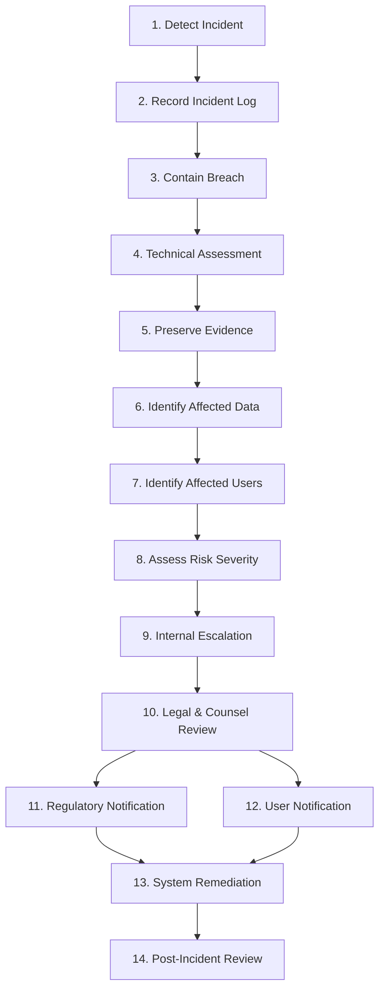

# ArthaNova Accounts — Personal Data Breach Incident Response Runbook

> **LEGAL REVIEW REQUIRED**: This Breach Runbook outlines technical and operational incident-response procedures for ArthaNova Accounts under the Digital Personal Data Protection (DPDP) Act, 2023. Statutory notification obligations and deadlines must be confirmed by qualified legal counsel based on applicable rules and incident circumstances.

---

## 1. Objective & Scope

This runbook establishes a structured 14-step incident response procedure to detect, contain, investigate, report, and remediate personal data security breaches involving ArthaNova Accounts infrastructure, databases, third-party integrations (e.g. Resend, MongoDB Atlas, Render), or employee credentials.

---

## 2. Incident Response Workflow (14 Steps)



### Step 1: Detect
- Monitor automated alerts (error rates, rate limiter spikes, unauthorized admin access attempts).
- Receive internal or external vulnerability reports, user inquiries, or third-party processor security notifications.

### Step 2: Record
- Open an Incident Tracking Entry immediately.
- Record exact discovery time, source of report, impacted domain/server, and initial observations.
- Do not modify raw access logs or overwrite potential evidence.

### Step 3: Contain
- Revoke compromised credentials, API keys (e.g. Resend keys, JWT secrets), and administrative tokens.
- Block offending IP addresses or restrict backend routes via rate limiter / firewall rules.
- If necessary, temporarily disable impacted endpoints to isolate system memory/state.

### Step 4: Assess
- Perform emergency forensic analysis to determine the attack vector (e.g. unauthorized API invocation, credential stuffing, database misconfiguration).
- Validate system log integrity.

### Step 5: Preserve Evidence
- Take forensic snapshots of application logs (`morgan`, server logs, database audit logs).
- Preserve raw headers, IP logs, and database queries without alteration for legal or law enforcement inspection.

### Step 6: Identify Affected Data Categories
- Categorize compromised fields (e.g. Name, Email, Company Name, Country, Services Requested, Message Body, Consent Records).
- Confirm whether sensitive credentials (passwords, PINs) were affected. (Note: Passwords/PINs are stored as bcrypt hashes).

### Step 7: Identify Affected Data Principals (Users)
- Extract list of unique email addresses and data principals whose data was exposed or accessed without authorization.

### Step 8: Assess Risk Severity
- Evaluate harm likelihood (financial, reputational, identity theft, unauthorized disclosure).
- Assign incident severity rating: **LOW**, **MEDIUM**, **HIGH**, or **CRITICAL**.

### Step 9: Internal Escalation
- **72-hour internal escalation/Board notification target — LEGAL REVIEW REQUIRED**.
- Notify the Grievance Officer, Technical Leads, and Management Board within 72 hours of discovery (target standard).

### Step 10: Legal Review
- Engage legal counsel immediately to determine statutory notification obligations under the DPDP Act and applicable rules.
- *Statutory notification timelines and mandatory disclosure thresholds to be confirmed by legal counsel based on applicable DPDP Act/rules and incident circumstances.*

### Step 11: Regulatory / Authority Notification (If Required)
- Draft and transmit official incident notification to the Data Protection Board of India / relevant authority if required under legal counsel advice.

### Step 12: User Notification (If Required)
- If statutory rules require notification to affected Data Principals, issue clear, non-technical communications detailing nature of breach and recommended principal safeguards.

### Step 13: Remediation
- Patch root vulnerability, update software dependencies, rotate all secrets/keys, and deploy hardened security controls.
- Re-verify CAPTCHA, authentication middleware, and input sanitization.

### Step 14: Post-Incident Review & Lessons Learned
- Conduct post-mortem review within 7 business days of incident resolution.
- Update security architecture, logging procedures, and this Runbook based on findings.

---

## 3. Incident Notification Templates

### Template A: Board / Management Incident Notice

```text
SUBJECT: [URGENT] Personal Data Incident Internal Escalation — ArthaNova Accounts

CONFIDENTIAL & PRIVILEGED

Date/Time: [YYYY-MM-DD HH:MM IST]
Incident ID: INC-[YYYYMMDD-01]
Severity Level: [CRITICAL / HIGH / MEDIUM]

1. Overview:
A potential personal data security incident was detected on [Date/Time] involving [impacted system e.g., Contact Form API / Database / Admin Auth].

2. Scope & Affected Data:
- Data Categories Impacted: [Name, Email, Company, Message, Consent Records]
- Estimated Affected Data Principals: [Approximate Count]
- System Exposure Status: [Contained / Ongoing Mitigation]

3. Immediate Actions Taken:
- [Rotated JWT secrets / Blocked malicious IP range / Isolated database connections]
- Evidence preserved in accordance with forensic protocols.

4. Next Steps & Legal Review:
- Legal counsel engaged to evaluate Data Protection Board notification requirements.
- Internal escalation target: Within 72 hours of discovery — LEGAL REVIEW REQUIRED.

Prepared by: [Incident Lead Name / Grievance Officer]
```

---

### Template B: Affected User Notice (Data Principal Notification)

```text
SUBJECT: Important Notice Regarding Your Personal Data — ArthaNova Accounts

Dear [User Name],

We are writing to inform you of a recent security incident that may have involved some of your personal information submitted to ArthaNova Accounts.

What Happened:
On [Date], we identified an unauthorized incident affecting [brief description e.g., an isolated web service component].

What Information Was Involved:
The information potentially accessed includes: [Name, Work Email, Company Name, Inquiry Message]. No financial credentials, passwords, or authentication PINs were compromised.

What We Are Doing:
Upon discovery, our technical team immediately contained the incident, patched the underlying issue, rotated operational security credentials, and enhanced platform monitoring. We have also informed relevant authorities and legal counsel in accordance with applicable data privacy laws.

What You Can Do:
We recommend remaining vigilant against unsolicited communications or phishing emails claiming to be from ArthaNova Accounts. We will never ask for passwords or sensitive credentials via email.

For Questions or Grievances:
If you have any questions or wish to exercise your data rights, please contact our Privacy Grievance Officer at:
Email: amisampatacca@gmail.com
Data Rights Portal: https://arthanovaccounts.com/data-rights

Sincerely,
ArthaNova Accounts Management Team
```

---

### Template C: Regulatory / Authority Notice (Data Protection Board / Authority)

> **LEGAL REVIEW REQUIRED**: Wording, statutory citations, format, and timing of regulatory notices must be reviewed and customized by qualified legal counsel prior to submission.

```text
TO: Data Protection Board of India / Relevant Data Protection Authority
FROM: ArthaNova Accounts (Data Fiduciary)
DATE: [YYYY-MM-DD]
SUBJECT: Notification of Personal Data Security Breach under DPDP Act

1. Data Fiduciary Details:
- Entity Name: ArthaNova Accounts
- Contact Email: amisampatacca@gmail.com
- Designated Officer: Privacy & Data Protection Grievance Officer

2. Description of Incident:
- Date and Time of Occurrence: [Date/Time]
- Date and Time of Detection: [Date/Time]
- Nature of Breach: [e.g., Unauthorized API Access / Exfiltration / System Misconfiguration]

3. Nature and Scope of Personal Data Involved:
- Categories of Data: [Name, Contact Email, Business Inquiry Details, Consent Logs]
- Number of Data Principals Affected: [Approximate Number]

4. Likely Consequences of the Breach:
- Risk Assessment: [Description of potential risk to Data Principals]

5. Remedial Measures Implemented or Proposed:
- Technical containment actions executed.
- Infrastructure security patch deployed.
- Password/API key rotation executed.

6. Communications to Data Principals:
- [Status of notification to affected Data Principals]

Submitted by Authorized Officer pending legal counsel confirmation.
```
